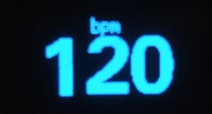
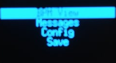
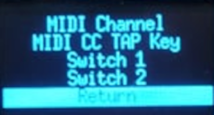
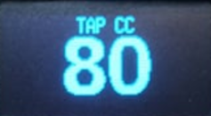

# Midiclock

This device is designed to generate Midi Clock messages according to the BPM (beats per minute) set.


The BPM can be set by three sources:

- using the dial button available on the front of the device;
- tapping the desired beat on using the footswitch available on the front of the device; or
- sending a configured MIDI control change message to the device on the configured channel.
## Menu structure


### BPM View

It displays a big number indicating the current BPM set. Pushing the dial button the main menu is called.



### Main Menu

It allows to Access others options available on Midiclock device, such as:

- display MIDI messages incomming into the devices
- call the Configuration Menu
- save current settings
- go back to BPM View


### Messages

It is a debugging tool that shows all MIDI messages incoming the device.

Pushing the dial button makes to come back to the Main Menu.


### Config

It allows to configure some behavior of the Midiclock Device, such as:

- set which MIDI channel is used in order to capture the TAP tempo
- set which MIDI Control is used in order to be used as TAP tempo control
- the behavior of the Switch 1
- the behavior of the Switch 2



### Midi Channel

Channels 1 to 15 can be selected. If channel 0 (zero) is selected, the device will accept all channel sources.

Pushing the dial button over the "Return" option makes to come back to the Main Menu.


### Midi Control Change Message

Any Control Change Code can be used as TAP Tempo selector. The device sending the control change message must send 127 as a value.

A typical TAP tempo Control Change message for Code 80, on the MIDI channel 1, would be:

```
0xb1 0x50 0x7f
```

Pushing the dial button over the "Return" option makes to come back to the Main Menu.



### Switch 1 and 2 modes

Midclock devices control two digital switches, named "1" and "2". These keys are isolated from one another and have no connection to the device circuitry as they are optically driven.

The Switches can be configured as follows:

- normally closed
- normaly open
- lacthed

The check mark indicate the current mode. Use dial button to select the desided behaviour and dial the button to check it.

Pushing the dial button over the "Return" option makes to come back to the Main Menu.


## MIDI test commands

It follows some commands available on linux for debugging purposes

### Testing MIDI Program Change Messages

The device does not honor MIDI Program Change Messages, but these messages can be viewed on the Messages Display.

``` shell
[hgamal@ygamal src]$ amidi -p hw:2,0,0 --send-hex=c001
[hgamal@ygamal src]$ amidi -p hw:2,0,0 --send-hex=c002
```

### Tap Tempo MIDI Control Change Messages

It sending two or more messages as followed, it will change the current Beat per Minute settings.

``` shell
[hgamal@ygamal src]$ amidi -p hw:2,0,0 --send-hex=b1507f
```

### Checking BPM Acurracy

The 'count.cpp' program can be used to verify the Beats per Minute accuracy produced by the device.

The program counts the number of MIDI Clock messages taking into account the time elapsed between them and calculates the obtained Beats per Minute.

``` shell
[hgamal@ygamal src]$ amidi -d -c -p hw:2,0,0 | ../count
```
